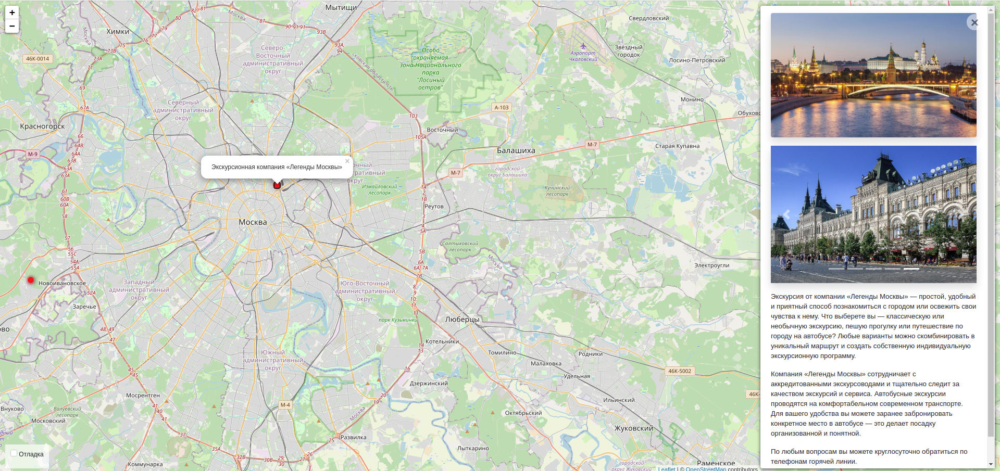

# Пишем Яндекс.Афишу
Предложения о досуге в Москве

[](https://www.python.org/)
[](https://www.djangoproject.com/)


[деплой проекта на https://www.pythonanywhere.com](http://toshiharu.pythonanywhere.com/)

## Описание
Данная программа информирует о досуговых центрах(ДЦ) в Москве. База ДЦ заполняются администратором ресурса.

## Запуск
Для запуска сайта вам понадобится Python третьей версии.

Скачайте код с GitHub:

```shell
git clone https://github.com/toshiharu13/where_to_go.git
```

Установите зависимости:

```shell
pip install -r requirements.txt
```

Создайте базу данных SQLite

```shell
python3 manage.py migrate
```

Запустите сервер

```shell
python3 manage.py runserver
```
## Переменные окружения
Часть настроек проекта берётся из переменных окружения. Чтобы их определить, создайте файл `.env` рядом с `manage.py` и запишите туда данные в таком формате: `ПЕРЕМЕННАЯ=значение`.

- `DEBUG` — дебаг-режим. Поставьте `True`, чтобы увидеть отладочную информацию в случае ошибки.
- `SECRET_KEY` — секретный ключ проекта
- `ALLOWED_HOSTS` — см [документацию Django](https://docs.djangoproject.com/en/3.1/ref/settings/#allowed-hosts)

## Цели проекта

Код написан в учебных целях — для курса по Python и веб-разработке на сайте [Devman](https://dvmn.org).
